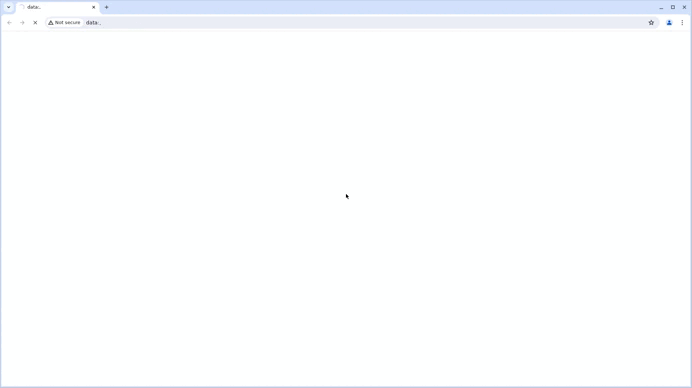
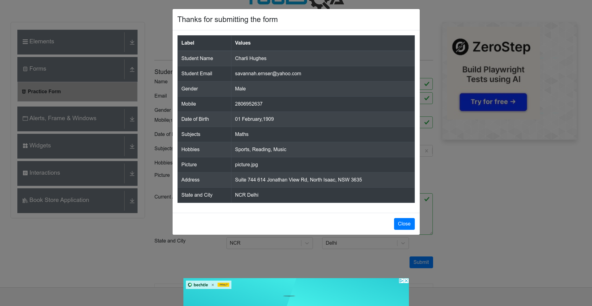

# Автоматизированное тестирование формы на DemoQA

[](https://jenkins.autotests.cloud/job/SimleFormTest/)
[](https://jenkins.autotests.cloud/job/SimleFormTest/allure/#suites)


## Описание проекта

Проект представляет собой набор автоматизированных тестов для проверки работы формы регистрации на сайте [DemoQA](https://demoqa.com/). Тесты написаны на Java с использованием фреймворка Selenide, и генерируют детальные отчеты Allure.

---

## Содержание
- [Технологии](#технологии)
- [Установка и запуск](#установка-и-запуск)
  - [Локальный запуск](#локальный-запуск)
  - [Запуск через Jenkins](#запуск-через-jenkins)
- [Демонстрация работы](#демонстрация-работы)

---

## Технологии

- **Язык программирования:** Java
- **Инструмент для тестирования:** Selenide
- **Сборщик проекта:** Gradle
- **Генератор отчетов:** Allure
- **CI/CD система:** Jenkins
- **Паттерн проектирования:** PageObject
- **Библиотека для генерации данных:** JavaFaker

---


## Установка и запуск

### Локальный запуск

1. **Установите необходимые зависимости:**
  - JDK 11 или выше
  - Gradle
  - Браузер Chrome

2. **Клонируйте репозиторий:**
   ```bash
   git clone https://github.com/AndreyBobb/TestSimpleForm.git
   
3. **Перейдите в директорию проекта:**
    ```bash
   cd TestSimpleForm

4. **Запустите тесты:**
    ```bash
   ./gradlew clean test

5. **Сгенерируйте и просмотрите отчет Allure:**
    ```bash
   ./gradlew allureReport
   ./gradlew allureServe
После выполнения команды *allureServe*, откроется браузер с детальным отчетом.

---

## Запуск через Jenkins

### Настройка job в Jenkins

1. **Создайте новый job:**

 - В Jenkins перейдите в раздел "New Item".
 - Выберите тип job "Freestyle project"
 - Укажите имя job (например, demoqa-tests).

2. **Настройте источник кода:**

 - В секции "Source Code Management" выберите "Git".
 - Укажите URL репозитория: 
    ```bash  
     https://github.com/AndreyBobb/TestSimpleForm.git
3. **Добавьте шаг сборки:**
 - В секции "Build" добавьте шаг "Execute shell" или "Invoke Gradle script".
 - В поле команды укажите:
    ```bash 
   ./gradlew clean test
   
4. **Настройте генерацию отчетов Allure:**
  - В секции "Post-build Actions" добавьте "Publish Allure Report".
  - Укажите путь к результатам тестирования (build/allure-results/).

 ### Запуск job

1. Запустите job:
 - После сохранения конфигурации нажмите кнопку "Build Now".
2. Просмотр результатов:
 - После завершения job перейдите в раздел "Allure Report", чтобы посмотреть детальный отчет о выполнении тестов.

---

## Демонстрация работы

### Видео теста

### Последний скриншот


